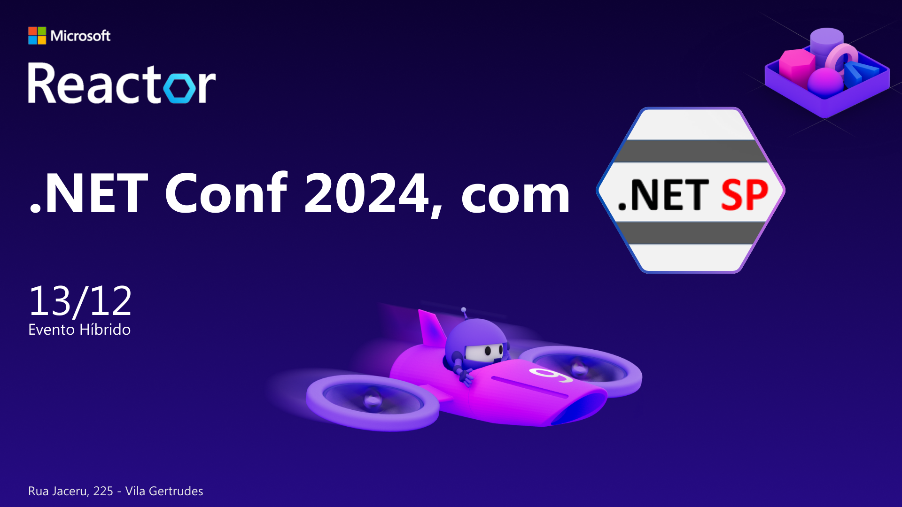
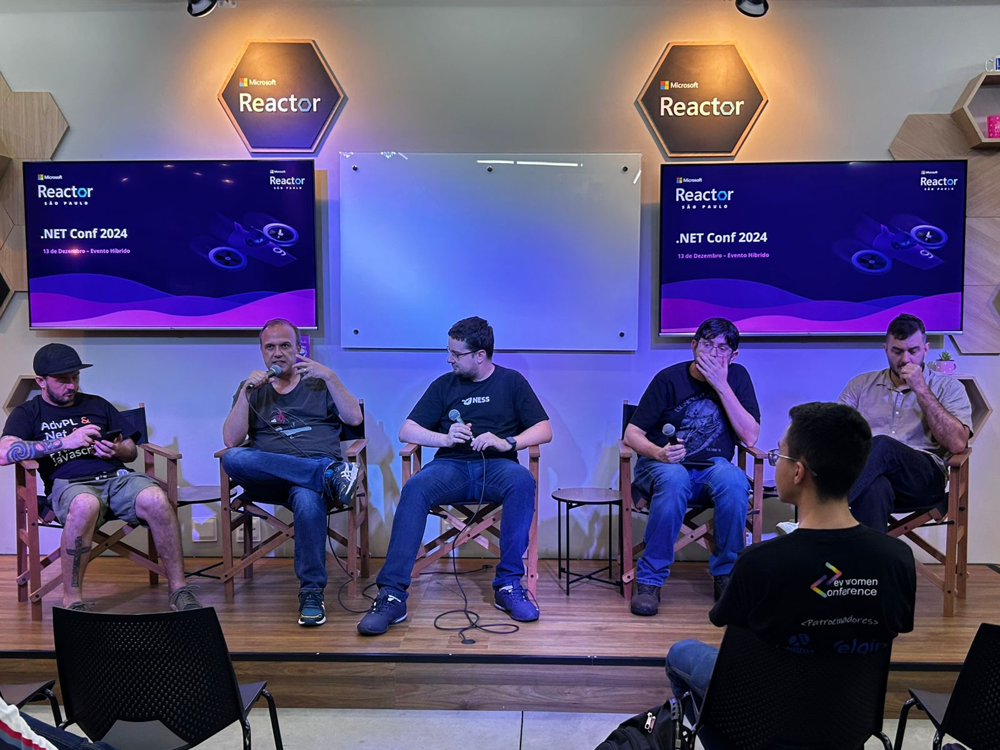
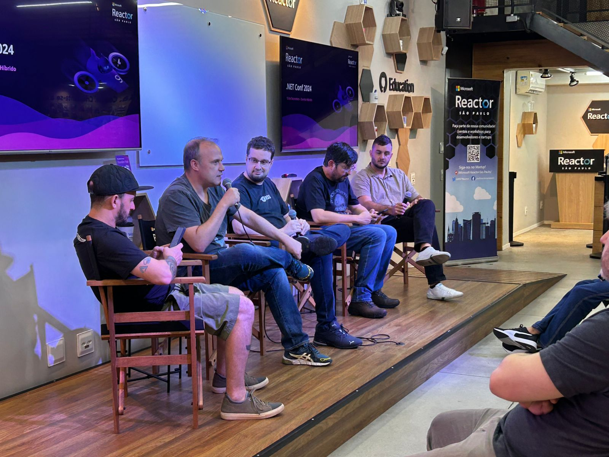
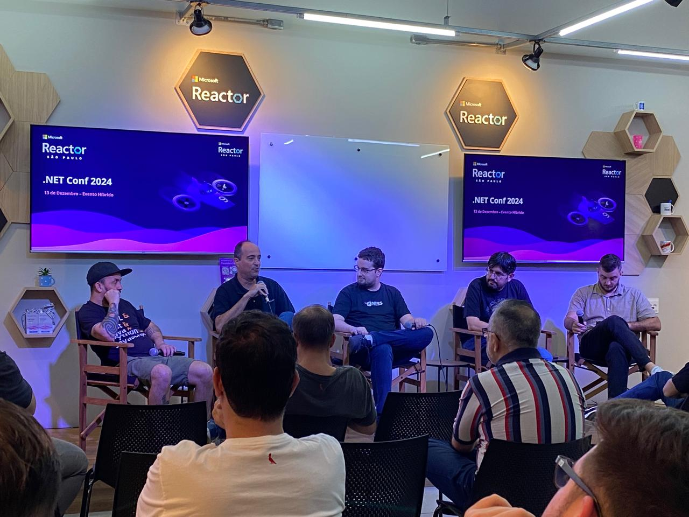
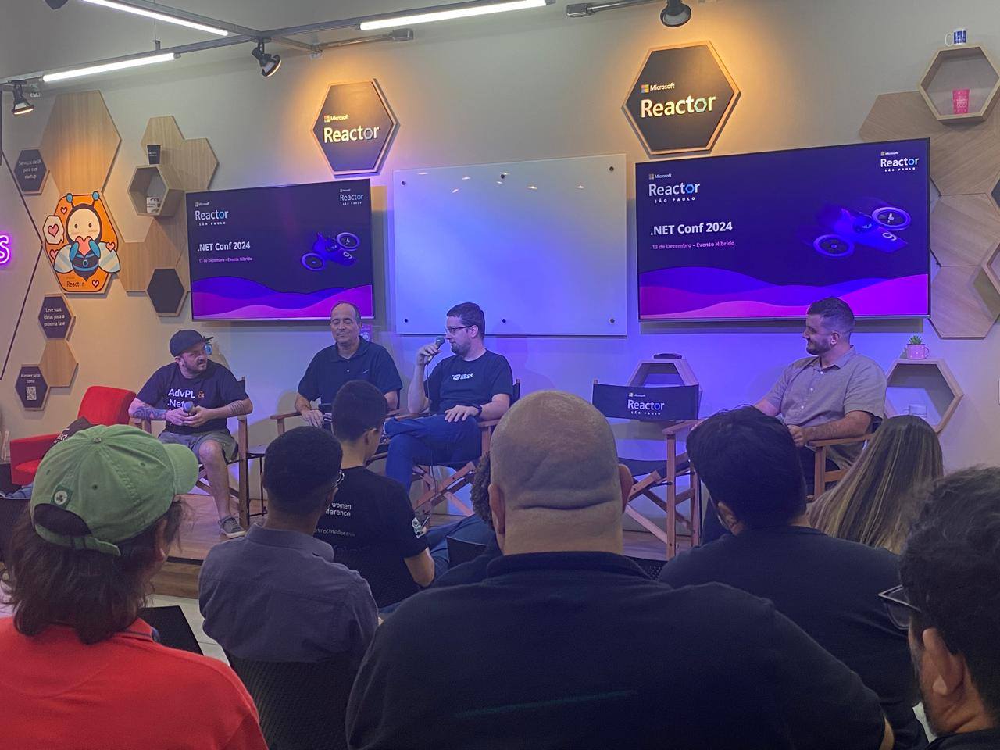
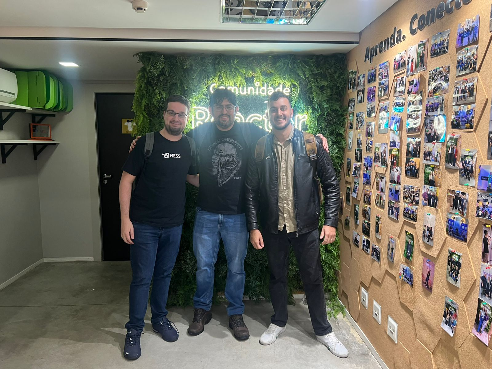
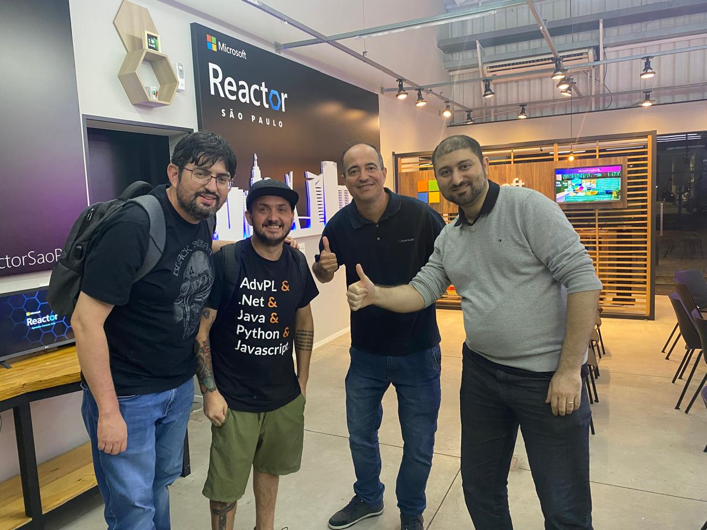

# .NET Conf 2024 - Edição de Final de Ano - São Paulo-SP
Fotos e informações gerais sobre o evento ".NET Conf 2024 - Edição de Final de Ano - São Paulo-SP", realizado em 13/12/2024 na cidade de São Paulo-SP.

Organizadores:
- **Renato Groffe (Microsoft MVP, Docker Captain, MTAC)**
- **Thiago Bertuzzi (Microsoft MVP)**

Número de participantes: **23 pessoas**

---

Apresentações/painéis que aconteceram durante o evento:

_# Novidades na nuvem e DevOps: Azure, GitHub, Azure DevOps e muito mais!_

Participantes:
- Vinicius Moura (Microsoft MVP)
- Renato Groffe (Microsoft MVP, Docker Captain, MTAC)
- Thiago Bertuzzi (Microsoft MVP)
- Talles Valiatti (Microsoft MVP)
- Milton Camara Gomes (Microsoft MVP)

Tecnologias abordadas: **.NET 9, Docker, Kubernetes, Visual Studio 2022, Visual Studio Code, GitHub Copilot, Azure OpenAI, Azure DevOps, GitHub Actions, Microsoft Azure**

_# Novidades no Desenvolvimento de Aplicações: .NET 9, ASP.NET Core, MAUI, Visual Studio..._

Participantes:
- Renato Groffe (Microsoft MVP, Docker Captain, MTAC)
- Thiago Bertuzzi (Microsoft MVP)
- Talles Valiatti (Microsoft MVP)
- Milton Camara Gomes (Microsoft MVP)
- Ramon Durães (Microsoft MVP)

Tecnologias abordadas: **.NET 9, ASP.NET Core, C# 13, MAUI, Blazor, Aspire, Docker, Kubernetes, Visual Studio 2022, Visual Studio Code, Azure OpenAI, Ollama, Semantic Kernel, AI Building Blocks, OpenTelemetry, Redis, Microsoft Azure**

---

Acesse este [**link**](/img/) para visualizar todas as fotos das apresentações.

Para acessar a gravação do evento no **YouTube** clique neste [**link**](https://youtu.be/hiqYueFjdXQ).

Este evento foi uma parceria entre a comunidade [**.NET SP**](https://www.meetup.com/dotnet-Sao-Paulo/) e o [**Microsoft Reactor**](https://www.meetup.com/Microsoft-Reactor-Sao-Paulo/).

Formulário utilizado para inscrições: [**Microsoft Reactor**](https://developer.microsoft.com/pt-br/reactor/events/24087/?wt.mc_id=3reg_24087_webpage_reactor)

Local: Microsoft Reactor - Rua Jaceru, 225 - Vila Gertrudes - São Paulo - SP - CEP: 04705-000

Deixamos aqui nossos agradecimentos ao Victor Temple e à Larissa Cyganski pela oportunidade e todo o apoio para promovermos esta edição local do .NET Conf no Microsoft Reactor em São Paulo-SP.

---

